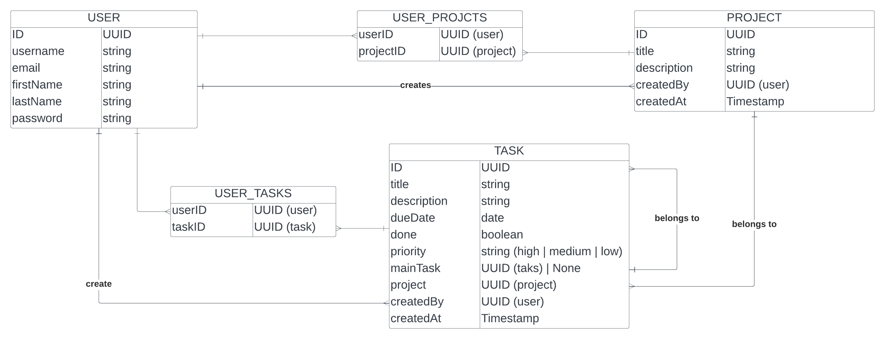

# StealthTask - Engineering Review Document (ERD)

## Overview
This document explores the design of StealthTask, a to-do website to manage your tasks and projects with simple user interface to stealth your task. 

We'll use a basic client/server architecture, where a single server is deployed on a cloud provider next to a relational database, and serving HTTP traffic from a public endpoint.

## Storage 
Firstly, we'll use a relational database, although we can potentially switch to something with a little more power such as document database in the future.

A minimal relational database implementation such as sqlite3 suffices.

### Entity Relationship Diagram (ERD):
